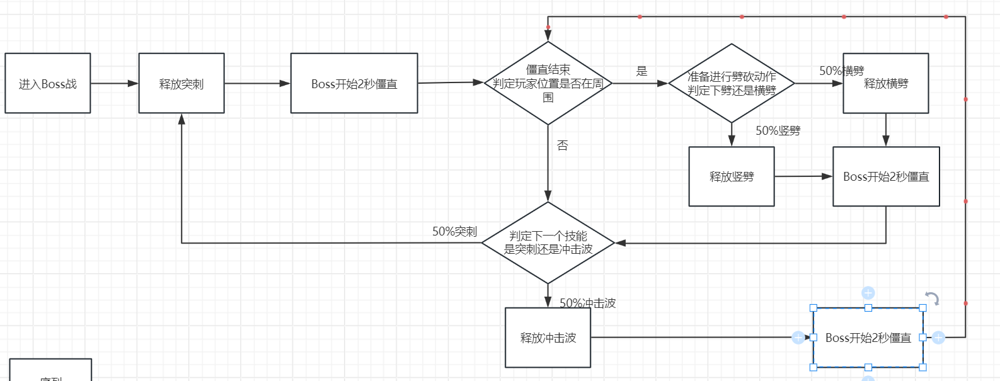
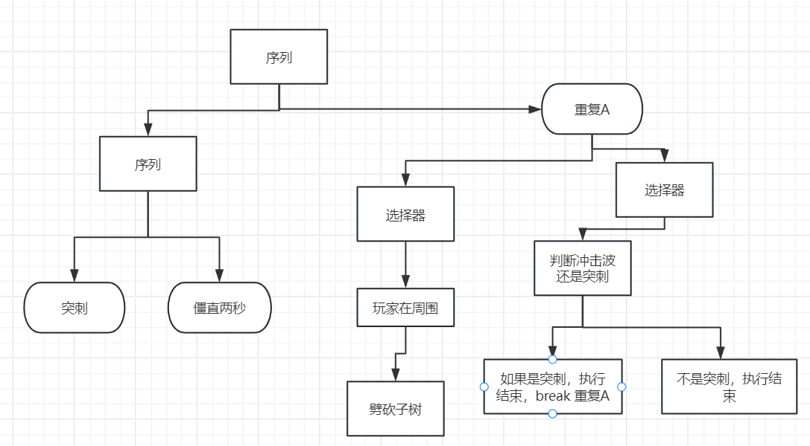

# 什么是技术策划

技术策划是把策划文档翻译为程序文档的工作，切记，技术策划是把你的逻辑浓缩，方便其他程序进行快速的阅读，而不是纸上谈兵的制作整个项目！！

## 状态机/行为树的制作

以下两个图是同一个设计，用状态机和行为树分别实现



行为树是一个正序的树，节点可以分为： 条件节点(Condition)，复合节点(Composite)，逻辑节点（Action),修饰节点(Decoration)，子树节点
其中，条件节点，和逻辑节点代表着一个逻辑（一行代码），一个复合节点是诺干个 "逻辑"（多行代码）组成的函数或分支，修饰节点则是修饰逻辑节点返回的结果，比如永远返回true
其中，复合节点拥有中断属性，也就是ConditionalAbort


## AI的制作/逻辑的梳理

**策划草案**

突刺： Boss有限跳跃到玩家固定距离出，然后往玩家固定距离出进行告诉突刺，可以跳跃躲避
下劈： Boss高举武器，蓄力1秒后下批，可以左右躲避
三联冲击： Boss用力下劈三次，每一次发出一道冲击波

**技术策划案**

```文字
AI资产 突刺{
    1. 获取玩家位置
    2. 计算根据Boss到玩家的方向为d
    3. 控制刚体，以AnimationCruve的速度，向前移动
        - 备注：使用RigidBoy2d.MovePosition即可不需要进行额外的物理计算
        - 可能存在的Bug：重力的处理和Rigidbody2d.MovePosition的冲突
}

AI资产 下劈砍{
    1. 播放动画，并为动画设置AnimationEvent
    2. 当收到AnimationEvent，在transform.position + offset的位置生成“DamageOnTouch”区域
}

AI资产 三联冲击{
    1. 播放动画，并为动画设置AnimationEvent
    2. 当收到AnimationEvent，在transform.position + offset的位置生成冲击波
           - 需要注意，冲击波可能浮空，所以需要用物理往下判定一下确保着地， 也就是冲击波这个prefab它需要pivot为脚底板
}

预制体 冲击波{
    - 子物体 图片
        - 脚本 SpriteRenderer
    - 脚本 ShockWave
}

脚本 ShockWave{
    OnCollisionEnter(collision: Collision2d){
        1. “CompareTag”也就是“对比标签”（墙壁）
            - 如果墙壁，那么就销毁本物体
            - 如果是玩家，则造成伤害， 不过我们统一由伤害机制的DamageOnTouch进行处理
    }
}

```
